<div align="center">

<!-- Banner -->


<!-- Animated Typing SVG -->
[](https://git.io/typing-svg)

<!-- Badges Section -->
<p align="center">
  
  
  
</p>

<p align="center">
  
  
  
</p>

<!-- Animated Line -->


</div>

<!-- About Section with Beautiful Box -->
<div align="center">
  
##  **About This Repository** 

</div>

<div align="center">
  
```diff
@@           🎯 Your One-Stop Solution for VIT Chennai Exam Preparation           @@
+ 📚 Comprehensive Collection of Previous Year Question Papers
+ 🎓 Organized by Subject and Exam Type
+ 🤝 Community-Driven and Open Source
+ 🆓 100% Free Access for All Students
```

</div>

<!-- Features Section with Cards -->
<div align="center">

## ✨ **Features That Make Us Special**

</div>

<table align="center">
  <tr>
    <td align="center" width="33%">
      
      <h4>📦 Extensive Archive</h4>
      <p>Years of question papers<br>at your fingertips</p>
    </td>
    <td align="center" width="33%">
      
      <h4>🗂️ Smart Organization</h4>
      <p>Easy navigation with<br>systematic structure</p>
    </td>
    <td align="center" width="33%">
      
      <h4>🤝 Community Driven</h4>
      <p>Built by students<br>for students</p>
    </td>
  </tr>
</table>

<!-- Cool Divider -->
<div align="center">
  
</div>

<!-- Repository Structure with Beautiful Tree -->
<div align="center">

## 🏗️ **Repository Structure**

```mermaid
graph TD
    A[📁 VIT-PYQPs-Paaji] --> B[📚 Subject Folders]
    B --> C[📄 CAT Papers]
    B --> D[📄 FAT Papers]
    B --> E[📄 Lab Papers]
    
    style A fill:#ff6b6b,stroke:#fff,stroke-width:4px,color:#fff
    style B fill:#4ecdc4,stroke:#fff,stroke-width:2px,color:#fff
    style C fill:#45b7d1,stroke:#fff,stroke-width:2px,color:#fff
    style D fill:#96ceb4,stroke:#fff,stroke-width:2px,color:#fff
    style E fill:#ffeaa7,stroke:#fff,stroke-width:2px,color:#fff
```

</div>



<!-- Directory Structure -->
<div align="center">
  
```bash
📂 VIT-PYQPs-Paaji/
│
├── 📘 Mathematics/
│   ├── 📝 CAT-1_2023.pdf
│   ├── 📝 CAT-2_2023.pdf
│   └── 📝 FAT_2023.pdf
│
├── 📗 Physics/
│   ├── 📝 CAT-1_2023.pdf
│   └── 📝 FAT_2023.pdf
│
└── 📙 Chemistry/
    └── 📝 All_Papers.pdf
```

</div>

<!-- How to Use Section -->
<div align="center">
  
## 🚀 **Quick Start Guide**


</div>

<table>
  <tr>
    <td align="center">
      
      <br><b>Browse</b>
      <br>Navigate to your subject
    </td>
    <td align="center">
      
      <br><b>Select</b>
      <br>Choose your exam type
    </td>
    <td align="center">
      
      <br><b>Download</b>
      <br>Get the PDF instantly
    </td>
    <td align="center">
      
      <br><b>Study</b>
      <br>Ace your exams! 🎯
    </td>
  </tr>
</table>

<!-- Contribution Section -->
<div align="center">
  
## 🤝 **How to Contribute**


**We love contributions! Every paper you add helps thousands of students** 💖

</div>

<div align="center">

[](http://makeapullrequest.com)
[](https://github.com/ellerbrock/open-source-badges/)

</div>



<details>
<summary><b>📋 Contribution Guidelines (Click to expand)</b></summary>

<br>

```mermaid
flowchart LR
    A[🍴 Fork] --> B[📝 Add Papers]
    B --> C[✅ Commit]
    C --> D[🚀 Push]
    D --> E[🔄 Pull Request]
    E --> F[🎉 Merged!]
    
    style A fill:#667eea,stroke:#fff,stroke-width:2px,color:#fff
    style B fill:#764ba2,stroke:#fff,stroke-width:2px,color:#fff
    style C fill:#f093fb,stroke:#fff,stroke-width:2px,color:#fff
    style D fill:#f5576c,stroke:#fff,stroke-width:2px,color:#fff
    style E fill:#4facfe,stroke:#fff,stroke-width:2px,color:#fff
    style F fill:#43e97b,stroke:#fff,stroke-width:2px,color:#fff
```

- ✅ Use clear, consistent naming: `SubjectName_ExamType_Year.pdf`
- ✅ Ensure PDFs are readable and complete
- ✅ Verify paper authenticity before uploading
- ✅ Create proper folder structure if needed
- ❌ Don't upload copyrighted material
- ❌ Don't include personal information

</details>

<!-- Stats Section -->
<div align="center">
  
## 📊 **Repository Stats**


</div>

<!-- Contact Section -->
<div align="center">
  
## 📬 **Get In Touch**


<p align="center">
  <a href="mailto:puneet.chandna2022@vitstudent.ac.in">
    
  </a>
  <a href="https://x.com/puneet_chandna_">
    
  </a>
  <a href="https://github.com/puneet-chandna">
    
  </a>
</p>

</div>

<!-- Support Section -->
<div align="center">
  
## 💖 **Support This Project**


**If this repository helped you, please consider:**

<p align="center">
  <a href="https://github.com/puneet-chandna/VIT-PYQPs-Paaji">
    
  </a>
  <a href="https://github.com/puneet-chandna/VIT-PYQPs-Paaji/fork">
    
  </a>
  <a href="#">
    
  </a>
</p>

</div>

<!-- Fun Facts -->
<div align="center">
  
## 🎯 **Fun Facts**

<table>
  <tr>
    <td align="center">
      <h3>📈</h3>
      <b>Papers Added</b><br>
      500+
    </td>
    <td align="center">
      <h3>👥</h3>
      <b>Contributors</b><br>
      50+
    </td>
    <td align="center">
      <h3>📚</h3>
      <b>Subjects Covered</b><br>
      30+
    </td>
    <td align="center">
      <h3>🎓</h3>
      <b>Students Helped</b><br>
      1000+
    </td>
  </tr>
</table>

</div>

<!-- Footer -->
<div align="center">
  
---

### 🌟 **Together We Rise, Together We Shine** 🌟


<p align="center">
  Made with ❤️ by Puneet Chandna
  <br>
  <i>Not officially affiliated with VIT Chennai</i>
</p>

</div>


